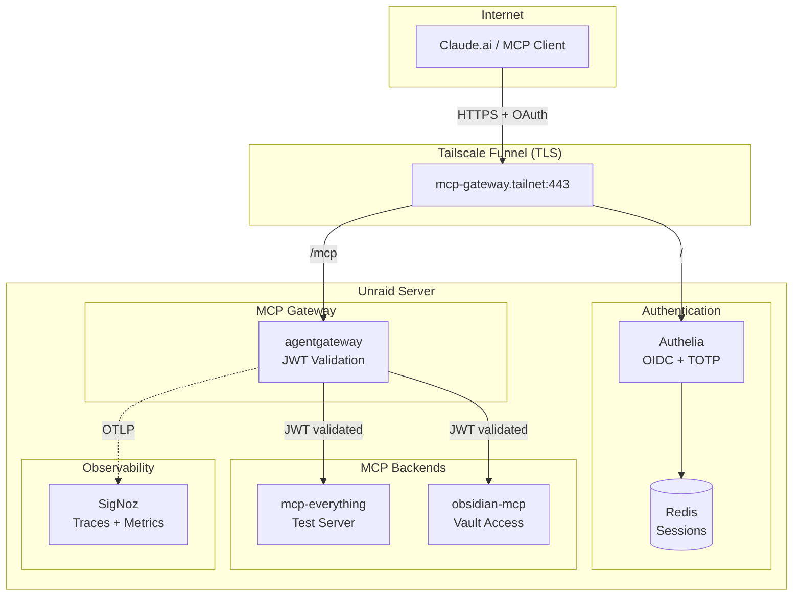

# Unraid MCP Gateway

Personal infrastructure for deploying an MCP (Model Context Protocol) gateway on Unraid. Enables Claude.ai and other MCP clients to securely access self-hosted tools via OAuth 2.0 authentication.

> **This is a personal homelab project.** No support provided. Fork it, learn from it, adapt it. See [CONTRIBUTING.md](CONTRIBUTING.md).

## Architecture



## What's In The Box

| Component | Purpose |
|-----------|---------|
| **Tailscale Funnel** | Public HTTPS ingress with automatic TLS |
| **Authelia** | OIDC provider with TOTP 2FA |
| **agentgateway** | MCP proxy with JWT validation and CORS |
| **Redis** | Session storage for Authelia |
| **mcp-everything** | Test MCP server for development |
| **obsidian-mcp** | Remote Obsidian vault access via MCP |
| **SigNoz** | OpenTelemetry traces, metrics, and logs |

## Quick Start

```bash
# SSH to server
ssh root@<unraid-ip>

# Check stack status
docker ps --format "table {{.Names}}\t{{.Status}}" | grep -E 'mcp|authelia|tailscale|signoz'

# View gateway logs
docker logs -f agentgateway

# Restart everything
docker restart redis-mcp authelia mcp-everything obsidian-mcp agentgateway tailscale-mcp
```

## Documentation

| Doc | Description |
|-----|-------------|
| [Current State](docs/deployment/current-state.md) | Live deployment snapshot with all configs |
| [Add MCP Server](docs/deployment/add-mcp.md) | How to add new MCP backends |
| [Unraid Setup](docs/deployment/unraid-setup.md) | Initial deployment guide |
| [SigNoz Setup](docs/observability/signoz-setup.md) | Observability platform installation |
| [Obsidian Architecture](docs/deployment/obsidian-mcp-architecture.md) | How the Obsidian MCP integration works |

## Project Structure

```
.
├── docs/
│   ├── deployment/        # Setup guides, current state, troubleshooting
│   ├── observability/     # SigNoz, monitoring
│   ├── research/          # Comparisons and decisions
│   └── roadmap/           # Ideas and planned work
├── dockerfiles/           # Custom Docker images
├── gateway/               # agentgateway configurations
├── scripts/               # Utility scripts
└── unraid-app-template/   # Reusable CI/CD template
```

## Secrets Management

Sensitive values are encrypted with [git-crypt](https://github.com/AGWA/git-crypt).

```bash
# Unlock after cloning (requires GPG key)
git-crypt unlock

# Check encryption status
git-crypt status
```

## License

[MIT](LICENSE) - Do whatever you want with it.
