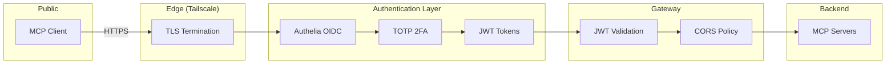

# Security Policy

Personal homelab project. No SLAs, no guarantees, no hand-holding.

## Reporting a Vulnerability

Found something sketchy? I'd genuinely appreciate a heads up.

Use [GitHub's private vulnerability reporting](https://docs.github.com/en/code-security/security-advisories/guidance-on-reporting-and-writing-information-about-vulnerabilities/privately-reporting-a-security-vulnerability) to let me know.

## Security Architecture

## Security Measures

| Layer | Measure | Implementation |
|-------|---------|----------------|
| **Transport** | TLS 1.3 | Tailscale Funnel |
| **Authentication** | OAuth 2.0 + OIDC | Authelia |
| **MFA** | TOTP | Authelia |
| **Authorization** | JWT validation | agentgateway |
| **Network** | Container isolation | Docker bridge network |
| **Secrets** | Encrypted at rest | git-crypt |
| **Sessions** | Server-side storage | Redis |

## What's NOT Hardened

This is a homelab. Some things are optimized for convenience:

- Admin UIs accessible on local network without auth
- SigNoz dashboard has no authentication
- No rate limiting on MCP endpoints
- No WAF or DDoS protection (Tailscale provides some inherent protection)

## Disclaimer

Use at your own risk. This is my homelab config, not a production security reference.

If you're deploying this in a real environment, you probably want to:

- Add rate limiting
- Put auth on admin interfaces
- Set up alerting for suspicious activity
- Actually read the Authelia security docs
