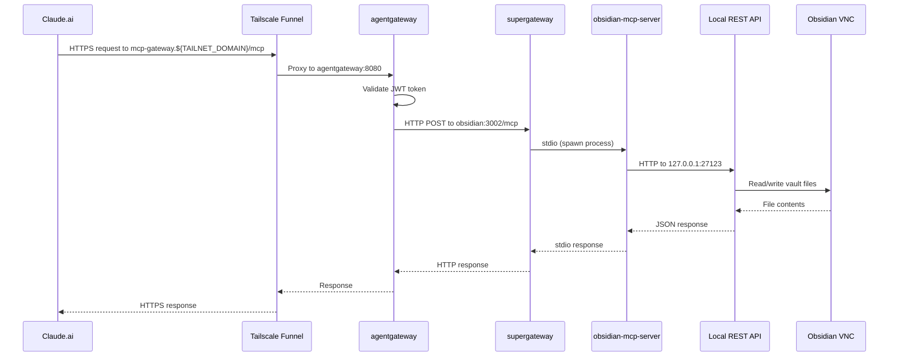

# Obsidian MCP Architecture

## Request Flow



## Container Architecture

```mermaid
graph TB
    subgraph Internet
        Claude[Claude.ai]
    end

    subgraph Tailscale["Tailscale Funnel"]
        TS[mcp-gateway.${TAILNET_DOMAIN}:443]
    end

    subgraph MCP_Net["Docker Network: mcp-net (172.19.0.0/16)"]
        AG[agentgateway<br/>172.19.0.3:8080]

        subgraph Obsidian_Stack["Shared Network Namespace"]
            OBS[obsidian VNC<br/>172.19.0.7<br/>REST API: 127.0.0.1:27123]
            OMCP[obsidian-mcp<br/>Port 3002<br/>--network container:obsidian]
        end

        EVERYTHING[mcp-everything<br/>172.19.0.6:3000]
    end

    Claude -->|HTTPS| TS
    TS -->|/mcp| AG
    AG -->|http://obsidian:3002/mcp| OMCP
    AG -->|http://mcp-everything:3000/mcp| EVERYTHING
    OMCP -->|127.0.0.1:27123| OBS

    style OMCP fill:#f9f,stroke:#333
    style OBS fill:#bbf,stroke:#333
```

## Why This Architecture?

### The Problem

The Obsidian Local REST API plugin binds to `127.0.0.1` only (localhost). This is a security feature - it prevents external access to your vault.

```
┌─────────────────────────────────────┐
│  Obsidian VNC Container            │
│                                     │
│  REST API listening on:             │
│  127.0.0.1:27123 ✓ (localhost only) │
│  0.0.0.0:27123   ✗ (not available)  │
└─────────────────────────────────────┘
```

### The Solution

Use Docker's `--network container:obsidian` mode. This makes obsidian-mcp share the same network namespace as the Obsidian VNC container.

```
┌─────────────────────────────────────────────────────┐
│  Shared Network Namespace                           │
│                                                     │
│  ┌──────────────────┐  ┌─────────────────────────┐  │
│  │ Obsidian VNC     │  │ obsidian-mcp            │  │
│  │                  │  │                         │  │
│  │ REST API binds   │  │ Can reach 127.0.0.1     │  │
│  │ 127.0.0.1:27123  │◄─│ because same namespace! │  │
│  └──────────────────┘  └─────────────────────────┘  │
│                                                     │
│  Both containers see the same "localhost"           │
└─────────────────────────────────────────────────────┘
```

## Component Details

| Component | Image | Purpose |
|-----------|-------|---------|
| obsidian | `lscr.io/linuxserver/obsidian` | VNC-based Obsidian with Local REST API plugin |
| obsidian-mcp | `ghcr.io/cameronsjo/obsidian-mcp` | MCP server wrapping your fork |
| supergateway | (bundled in image) | Converts stdio MCP to HTTP |
| agentgateway | `ghcr.io/agentgateway/agentgateway` | MCP multiplexer with JWT auth |

## Environment Variables

```bash
# obsidian-mcp container
OBSIDIAN_API_KEY=<from REST API plugin settings>
OBSIDIAN_HOST=127.0.0.1      # localhost because shared namespace
OBSIDIAN_USE_HTTP=true       # port 27123 (HTTP) vs 27124 (HTTPS)
PORT=3002                    # supergateway listens here
```

## Docker Run Command

```bash
docker run -d \
  --name obsidian-mcp \
  --network container:obsidian \
  --restart unless-stopped \
  -e OBSIDIAN_API_KEY=your-api-key \
  -e OBSIDIAN_HOST=127.0.0.1 \
  -e OBSIDIAN_USE_HTTP=true \
  -e PORT=3002 \
  ghcr.io/cameronsjo/obsidian-mcp:latest
```

## Tools Available

After deployment, these tools are available through the gateway (prefixed with `obsidian_`):

| Tool | Description |
|------|-------------|
| `obsidian_search` | Search notes by text |
| `obsidian_read_note` | Read note content |
| `obsidian_create_note` | Create new note |
| `obsidian_update_note` | Update existing note |
| `obsidian_list_notes` | List notes in directory |
| `obsidian_semantic_search` | AI-powered search (Smart Connections) |
| `obsidian_run_template` | Execute Templater templates |
